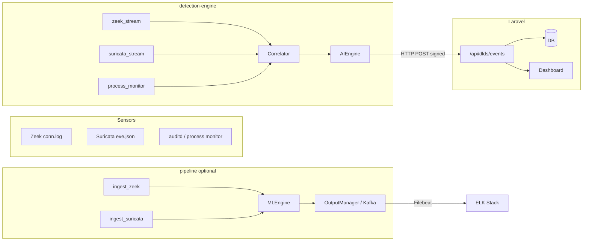

# AI-Assisted Network Traffic Forensics for Intrusion Detection — Project Guide

This document explains what **this repository (DLDS — Digital Leak Detection System / SOC dashboard)** does in relation to the course-style project brief (Zeek, Wireshark, Suricata, ML, ELK), how to run it, which files matter most, and **line-by-line** commentary for the core detection and training code.

---

## 1. How this repo matches your project brief

| Brief item | What you do in practice | Where it lives in this project |
|------------|-------------------------|--------------------------------|
| **Real-time IDS** | Zeek + Suricata + auditd feed a Python engine; Suricata rules produce alerts; correlation detects exfil patterns | `detection-engine/` (`zeek_stream.py`, `suricata_stream.py`, `process_monitor.py`, `correlator.py`) |
| **Wireshark — packet capture** | PCAPs can be captured offline and logs/telemetry fed into `data/`; tshark/PCAP workflow is documented in root `README.md` | `data/pcaps/`, `simulation/`, `pipeline/ingest_wireshark.py` |
| **Zeek — network forensics** | Tails `conn.log`, parses flows into normalized network events | `detection-engine/zeek_stream.py`, `parser_zeek.py` |
| **Suricata — IDS/IPS** | Tails `eve.json`, maps alerts to processes via socket tables | `detection-engine/suricata_stream.py`, `run_services.sh` |
| **TensorFlow / Scikit-learn** | Production training path uses **scikit-learn RandomForest** (not TensorFlow in-tree) | `ml/train_model.py`, `detection-engine/ai_engine.py`, `pipeline/inference.py` |
| **ELK — visualization** | Docker Compose brings up Elasticsearch, Logstash, Kibana; Filebeat ships normalized JSON | `docker-compose.elk.yml`, `elk/` |
| **Simulated traffic / validation** | Scripts for tcpreplay and health checks | `simulation/`, `scripts/`, `detection-engine/traffic-generator.sh` |

**Important nuance — two ML code paths:**

- **`detection-engine/ai_engine.py`** — Used by the **live correlator** (`correlator.py`). It loads `rf_model.pkl` but its default feature vector is small (`bytes_sent`, ports, `severity_score`, `is_sensitive_file`). If your saved bundle was trained by `ml/train_model.py` with the **full** feature list, you should use the same feature schema in `AIEngine` or route scoring through the **pipeline** `MLEngine`, which matches `train_model.py`.
- **`pipeline/inference.py` (`MLEngine`)** — Aligns with **`ml/train_model.py`**: same encoders and feature columns (`protocol_enc`, `flags_enc`, DNS/HTTP/TLS presence, etc.).

For coursework, state clearly which path you run: **“host sensor + correlator”** vs **“offline log pipeline + ELK.”**

---

## 2. What the project does (plain language)

1. **Sensors** observe the network and host: Zeek connection logs, Suricata EVE (alerts and metadata), and auditd-style process/file events.
2. A **correlation engine** joins what process touched sensitive files with how many bytes left the host to the internet, and enriches Suricata alerts with owning PID/command when possible.
3. An **ML classifier** (Random Forest, trained from your CSV datasets) labels traffic/events as benign / suspicious / malicious and attaches **evidence strings** for analysts.
4. **Laravel** exposes a signed HTTP API, stores events, and drives a **real-time SOC dashboard** (Reverb/WebSockets).
5. Optional **Kafka + Elastic stack** durably streams normalized events for **Kibana** dashboards and forensic search.

---

## 3. Architecture (data flow)



---

## 4. How to run

### 4.1 Prerequisites

- **PHP 8.3+**, **Composer**, **Node/npm**, **Python 3**, **Docker** (for Kafka/ELK), and on Linux: **Zeek**, **Suricata**, **auditd** (see root `README.md`).
- Copy **`.env.example`** → **`.env`**, run `php artisan key:generate`, configure database and `DLDS_API_KEY` / `DLDS_HMAC_SECRET`.

### 4.2 Laravel (dashboard + API)

```bash
composer install
npm install
cp .env.example .env
php artisan key:generate
php artisan migrate
npm run build
php artisan serve
# In another terminal (real-time UI):
php artisan reverb:start --host=127.0.0.1 --port=8080
```

Dashboard: `http://127.0.0.1:8000`  
Kibana (if ELK is up): `http://127.0.0.1:5601`

### 4.3 Train the ML model (real CSV data required)

```bash
cd ml
python -m venv .venv
# Windows: .venv\Scripts\activate
# Linux/macOS: source .venv/bin/activate
pip install pandas scikit-learn joblib numpy
python train_model.py --dataset-file path\to\your_dataset.csv
# or: python train_model.py --dataset-dir path\to\csv_folder
```

Artifacts: `ml/models/rf_model.pkl`, `ml/models/model_metadata.json`.  
Copy the pickle to `detection-engine/models/rf_model.pkl` if you want the host engine to load it from that folder.

### 4.4 Detection engine (Python, live sensors)

```bash
cd detection-engine
pip install -r requirements.txt
# Set DLDS_API_URL or LARAVEL_API_URL to your ingest endpoint, e.g.:
#   http://127.0.0.1:8000/api/dlds/events
export DLDS_API_KEY=your-key
export DLDS_HMAC_SECRET=your-secret
# Optional: allow deterministic scoring without a model (labs only):
# export DLDS_ALLOW_MOCK_MODEL=true
python main.py
```

Host service bootstrap (Zeek/Suricata) is **skipped by default** (`DLDS_SKIP_RUN_SERVICES` defaults true). To run `run_services.sh`, set `DLDS_SKIP_RUN_SERVICES=false` (Linux, requires sudo and installed packages).

### 4.5 Forensic pipeline (offline log tail + optional Kafka)

From **repository root**:

```bash
# Windows PowerShell example:
$env:PYTHONPATH = (Get-Location).Path
$env:PIPELINE_KAFKA_ENABLED = "true"
$env:PIPELINE_KAFKA_BOOTSTRAP_SERVERS = "127.0.0.1:19092"
python pipeline/main.py
```

Start stacks:

```bash
docker compose --project-name dlds_kafka -f docker-compose.kafka.yml up -d
./scripts/create_kafka_topics.sh
docker compose --project-name dlds_elk -f docker-compose.elk.yml up -d
```

### 4.6 `ran.sh` (Linux-oriented “one script”)

`ran.sh` assumes **bash**, **XAMPP** at `/opt/lampp`, **`$HOME/Downloads/DigitalForensics`** as `PROJECT_DIR`, and **`x-terminal-emulator`** for multiple terminals. On **Windows**, use **WSL** or follow the **manual** steps above and adjust paths. For a local clone at `X:\DigitalForensics`, edit `PROJECT_DIR` inside `ran.sh` or ignore the script and use `README.md` “Manual” section.

---

## 5. Most important files and roles

| Path | Role |
|------|------|
| `detection-engine/main.py` | Process entrypoint: optional service bootstrap, HTTP test event, worker threads for Zeek/Suricata/auditd streams and periodic `detect()`. |
| `detection-engine/correlator.py` | Merges process + network + IDS observations; rule-based exfil detection; calls `AIEngine`; POSTs to Laravel; optional SQLite. |
| `detection-engine/ai_engine.py` | Loads `rf_model.pkl`, feature extraction, mock/lab fallback, **safety overrides** for critical IDS keywords. |
| `detection-engine/config.py` | Env loading, API URL, Zeek/Suricata paths, **HMAC-signed** JSON ingest headers, HTTP session with retries. |
| `detection-engine/zeek_stream.py` | Follows `conn.log`, handles rotation, yields `type=network` events. |
| `detection-engine/suricata_stream.py` | Follows `eve.json`, yields `type=alert` / network metadata. |
| `ml/train_model.py` | End-to-end training: CSV ingest, feature engineering, RandomForest, metrics, saves bundle + metadata. |
| `pipeline/main.py` | Alternative real-time pipeline: tail logs, normalize, correlate, **`MLEngine`**, write JSON / Kafka, HTTP ingest. |
| `pipeline/inference.py` | **`MLEngine`**: loads training bundle, encodes protocol/flags, `predict_proba`, evidence summary. |
| `routes/api.php` | Laravel `POST /api/dlds/events`, stats, RBAC. |
| `docker-compose.elk.yml` / `docker-compose.kafka.yml` | Infra for ELK and Kafka. |
| `elk/filebeat/filebeat.yml` | Ships logs toward Kafka/Logstash. |
| `scripts/dlds_health_check.sh` | Verifies routing, DB, Reverb, Kafka, Elasticsearch, etc. |

---

## 6. Line-by-line reference (core files)

### 6.1 `detection-engine/main.py`

| Lines | What happens |
|-------|----------------|
| 1–4 | Module docstring: entrypoint runs Zeek, Suricata, auditd ingestion and correlation in worker threads. |
| 6–14 | Future annotations and stdlib imports (`logging`, `subprocess`, `threading`, `time`, `datetime`, `Path`, typing). |
| 16 | Third-party: `requests.Session` for HTTP. |
| 18–25 | Local `config` helpers (session, URL, timeouts, env bool/float, logging setup). |
| 26–29 | Correlator and three stream sources: process monitor, Suricata, Zeek. |
| 31 | Module logger. |
| 33–34 | Allow-lists for event `type` and `severity` strings. |
| 37–69 | `_run_services_script`: unless `DLDS_SKIP_RUN_SERVICES` is false, skips bash `run_services.sh`; otherwise runs it with timeout and optional verbose stdout/stderr. |
| 72–76 | `_as_int` parses integers safely with fallback. |
| 79–116 | `_normalize_event`: coerces type/severity, truncates description, maps alternate field names, **forces fresh UTC timestamp** (avoids dedup hash collisions on replay), builds Laravel-friendly dict. |
| 119–148 | `send_event`: POSTs normalized payload with **signed headers**; logs status; returns success on 200/201. |
| 151–158 | `_safe_worker`: restart loop if worker callback throws. |
| 161–240 | `main`: sets logging, optional `run_services`, builds HTTP session, optional startup **test event** (`DLDS_TEST_EVENT`), creates `Correlator`, defines four worker lambdas (Zeek/Suricata/process enumerate into `correlator.handle_event`; detect loop calls `correlator.detect()`), starts daemon threads, main loop watches thread health, Ctrl+C sets stop and joins. |
| 243–244 | Standard `if __name__ == "__main__": main()` guard. |

---

### 6.2 `detection-engine/ai_engine.py`

| Lines | What happens |
|-------|----------------|
| 1–7 | Imports: logging, `os`, typing, `pandas`. |
| 9–31 | `_OVERRIDE_KEYWORDS` / `_MALICIOUS_OVERRIDE_KEYWORDS`: uppercase tokens (e.g. EXPLOIT, C2) used in safety logic. |
| 35–47 | `AIEngine.__init__`: default feature names, reads `DLDS_ALLOW_MOCK_MODEL`, calls `_load_model()`. |
| 49–78 | `_load_model`: prefers `detection-engine/models/rf_model.pkl`, else `ml/models/rf_model.pkl`; `joblib.load` supports dict bundle (`model`, `features`, `model_version`) or raw estimator. |
| 80–104 | `extract_features`: numeric severity → `severity_score`; sensitive path heuristic (`/etc/` or “secret” in path). |
| 106–116 | `_evidence`: human-readable reasons from bytes, severity, sensitive file flag. |
| 118–146 | `_mock_predict`: **lab-only** deterministic score from features → label + reason. |
| 148–159 | `_aligned_anomaly_score`: maps label to consistent anomaly scale. |
| 161–173 | `_first_keyword`: scans alert_type + description for override keywords. |
| 175–232 | `_apply_safety_override`: for `type=alert`, bumps label/confidence when severity + signature/keywords demand (e.g. CRITICAL cannot be benign). |
| 234–295 | `predict`: extract features + evidence; if no model → `unscored` or mock; else build one-row `DataFrame`, `predict` / `predict_proba`, map class index or string to benign/suspicious/malignant, attach reason + evidence + version; always pass through `_apply_safety_override`. |

---

### 6.3 `detection-engine/correlator.py` (selected sections)

| Lines | What happens |
|-------|----------------|
| 1–16 | Docstring + imports (json, sqlite, threading, collections, pathlib, requests Session, local config, `NetMapper`, `rules`). |
| 40–45 | `_iso_from_zeek_ts` converts Zeek unix time string to ISO UTC. |
| 47–66 | `_empty_record` template for new correlated events. |
| 69–93 | `Correlator.__init__`: locks, per-PID deques for file accesses, byte counters, HTTP/SQLite config, logging. |
| 97–111 | `handle_event`: dispatches by `type` (`process` / `network` / `alert`); in `emit_mode=all`, normalizes observation and emits immediately. |
| 113–125 | `_handle_process`: records recent files per PID (max 512). |
| 127–153 | `_handle_network`: maps 5-tuple through `NetMapper` to PID, accumulates **bytes_sent** and last remote IP. |
| 155–197 | `_handle_suricata`: chooses “local” side using private IP rules, resolves PID, builds enriched **alert** record, emits. |
| 199–262 | `_normalize_observation`: converts raw stream dicts into canonical record layout per type. |
| 266–316 | `detect`: finds PIDs that touched **sensitive** files and exceeded byte threshold toward **outbound** candidates; emits **Data Exfiltration** alert once per (pid, path) key. |
| 320–340 | `_emit`: lazy-init `AIEngine`, merges AI fields into record, **prints JSON line** (stdout), POSTs if API URL set, else SQLite if path set. |
| 342–370 | `_post_http`: signed POST with cooldown on failures. |
| 372–385 | `_payload_for_api`: refreshes timestamp to “now” for API dedup behavior. |
| 387–459 | `_persist_sqlite`: creates `dlds_events` table if needed, inserts full row including AI fields. |

---

### 6.4 `ml/train_model.py`

| Lines | What happens |
|-------|----------------|
| 1–20 | argparse + json + sklearn metrics + preprocessing + RandomForest. |
| 22–28 | Paths: `ml/models`, `rf_model.pkl`, `model_metadata.json`, mkdir. |
| 31–35 | `_first_present`: picks first existing column from candidates. |
| 38–77 | Label column inference + `_normalize_label` maps many dataset conventions to benign/suspicious/malicious. |
| 80–137 | `_build_features`: ports, protocol string, bytes, duration, severity, frame length, tcp flags, **DNS/HTTP/TLS presence** flags from various column name aliases (CIC/UNSW style). |
| 141–158 | `_load_dataset`: one file or directory of CSVs, tags `__dataset_source`. |
| 161–247 | `train`: load data, require label col, encode protocol + tcp_flags with `LabelEncoder`, build `feature_cols`, stratified split, fit `RandomForestClassifier` (300 trees, balanced subsample), print report, `joblib.dump` **bundle** (model + encoders + feature list + version), write JSON **metadata** with metrics and label distribution. |
| 250–268 | CLI: `--dataset-file`, `--dataset-dir`, env fallbacks `DLDS_TRAIN_DATASET_FILE` / `DIR`. |

---

### 6.5 `pipeline/main.py`

| Lines | What happens |
|-------|----------------|
| 1–6 | Imports ingest modules, normalizer, correlator, `MLEngine`, `OutputManager`, `HTTPIngester`. |
| 17 | Basic logging config. |
| 19–23 | Env paths for Zeek JSON log, Suricata EVE, auditd log, local output dir. |
| 25–42 | `RealTimePipeline.__init__`: pipeline `Correlator` (30s window), `MLEngine`, `OutputManager`, `HTTPIngester`; logs Kafka status. |
| 44–57 | `process_event`: `classify` with ML, write local files, POST to API, log warnings for malicious/suspicious. |
| 59–79 | `consume_*`: three generators tailing logs → `normalize_event` → correlator hooks → `process_event`. |
| 81–96 | `start`: daemon threads for three consumers; main sleep loop; Ctrl+C flushes Kafka sink. |
| 98–101 | `__main__`: instantiate and `start()`. |

---

### 6.6 `pipeline/inference.py` — `MLEngine`

| Lines | What happens |
|-------|----------------|
| 1–3 | Imports: `os`, `joblib`, `pandas`. |
| 5–20 | Resolve absolute path to `ml/models/rf_model.pkl`; load dict with `model`, `features`, encoders, or set unloaded. |
| 22–26 | `_safe_encode`: unknown categorical value → `0`. |
| 28–86 | `classify`: if unloaded → `ml_label=unscored`; else builds **X** vector matching training script order, `predict_proba`, sets `ml_label` + `ml_confidence`, appends heuristic **evidence_summary** for malicious/suspicious/benign. |

---

### 6.7 `detection-engine/config.py` (highlights)

| Lines | What happens |
|-------|----------------|
| 20–32 | Loads `.env` from `detection-engine/` and repo root once. |
| 63–68 | `detection_api_url`: `DLDS_API_URL` then `LARAVEL_API_URL`. |
| 129–170 | `suricata_eve_path` / `zeek_conn_log_path`: env overrides + common install paths. |
| 173–204 | `signed_headers`: JSON body, timestamp, HMAC-SHA256 over `timestamp.body`, returns body + headers `X-API-KEY`, `X-TIMESTAMP`, `X-SIGNATURE`. |
| 218–234 | `build_http_session`: urllib3 retry policy for transient HTTP errors. |

---

## 7. Suggested coursework narrative

When you write your report or defense, you can structure it as:

1. **Environment** — test network or VM, capture with Wireshark/tshark, export or derive CSV features.  
2. **Zeek** — `conn.log` as structured metadata for flows and volumes.  
3. **Suricata** — signature-based alerts (`eve.json`) for known attack patterns.  
4. **ML** — train on labeled CSV (`ml/train_model.py`), evaluate precision/recall/F1 from printed report.  
5. **Integration** — events flow to Laravel API and optionally ELK for timeline analysis.  
6. **Validation** — replay PCAP (`simulation/`, `tcpreplay`), compare dashboard labels vs ground truth; use `scripts/dlds_health_check.sh` for stack sanity.

---

## 8. License / safety

Do not commit real secrets: replace `DLDS_API_KEY` / `DLDS_HMAC_SECRET` for each environment. The repo may contain sample keys or artifacts under `detection-engine/` — treat them as **non-production** only.

---

*Generated for the DigitalForensics / DLDS codebase. For day-to-day developer docs, see `README.md` and `README_AI.md`.*
